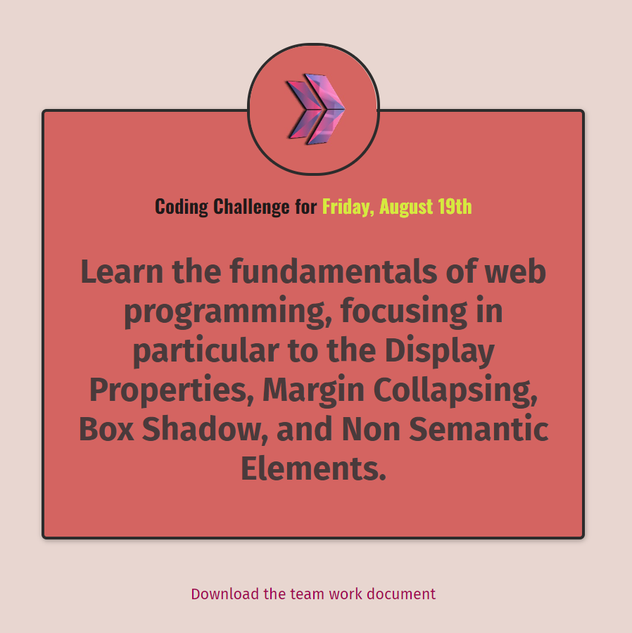

# Coding Challenge -: CSS Margins 

The purpose of this coding challenge is to write code that renders the page in the image.

##  Outcomes

👨‍💻 The main aim of this project are as follows; 

- analyze a problem, identify and apply programming knowledge for appropriate solution.

- demonstrate their knowledge of algorithmic design principles by using function effectively.

   
## Problem Statement

- Challenge is to build out this landing page and get it looking as close to the professional design as possible..

 ⌛ Happy Coding  ✍ 
